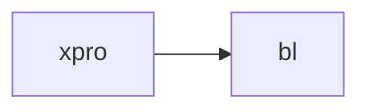

# Integration & Environment Management

This page is about how we coordinate development, release, and deployment across 
systems and integrated environments. 

# Misc Background and Conventions
* The systems we focus on here are bl, xpro (2.0), nuc, tradeplant, rates (orchestrator?) and pano-adx,
  because these constitute our target trading business as of end 2026. (We can separately discuss 
  interim state with XP1 and data hub)
* We use semantic versioning (major.minor.micro) for our systems and (therefore) our APIs:
  * major increment means breaking API change
  * minor increment means non-breaking API change
  * micro increment means no api changes
  * **TBD: or should one app version support multiple versions of its API(s)?**
* BL versions are <year>.<major>.<minor>.<mr>.<ebf> (with the last two optional/as needed):
  * major release increments are scheduled quarterly releases
  * minor (or "point") releases are scheduled monthly between majors
  * mr ("maintenence releases") are ad-hoc releases typically driven by specific team requests and are usually targeted or niche in scope. For these, we generally run a mini regression if the changes are substantial.
  * ebf ("emergency bug fixes") are also ad-hoc releases to address urgent production issues that cannot wait for the next scheduled release or even a mini-regression.
  * Note: we haven't yet established the rule that only major releases will make breaking API changes but presumably we will.
* We have multiple integrated application environments
  * qa (1-5) - for functional testing verifying the integrated system works before promoting it
  * staging - for user acceptance testing and demos
  * load - for load testing
  * prod - production
  * trading
  * dr
* There are generally multiple versions live in the environments at once, for example the state as of 2026-03-09 was planned to be (bl version shown): 
  * prod: 26.1.0
  * stg: 26.1.1
  * lt: 26.2.0
  * qa5: 26.1.1 (testing the next release scheduled to hit prod in March)
  * qa4: 26.1.2 (testing the next + 1 release scheduled to hit prod in April)
  * qa3: 26.1.0 (the current prod version - to explore identified scenarios, potential issues, etc.)
  * qa2: 26.2.0 (testing the next major release scheduled to hit prod in May)
* Systems frequently (but how frequently?) release to QA to avoid build up of untested items and long QA cycle between dev and release. But there is a tradeoff: daily releases of untested code leads to QA env being frequently broken.
* Kafka topics are named with `<domain>.<api>.<message>` convention
  * `<message>` is the type name of the object published on the topic (as defined in a schema file)
  * `<api>` is the name of the api (e.g. `canon` for canonical api)
  * `<domain>` is defined below
  * Message type names must therefore be unique within the namespace of an API.
* Kafka Infrastructure Notes
  * Each environment has its own kafka cluster with appropriate resources so that promotion doesn't require topic renaming
    * **TBD: or do we include the env as (say) a topic prefix, injected into placeholder via standard config/env var?**
  * There is network segregation between prod and non-prod environments so misconfigured qa can't hit prod
  * Lower environments (qa*, staging) will be "smaller": less hw, support fewer instruments and less trading activity
  * Higher environments (prod, dr and load) have equal capacity, including cluster hw and config, and support the same instruments and trading activity
* QUESTIONS
  * Are all commits to master deployed to QA? Or like pano can devs run the head of master and only start tagging
    versions that are release candidates? Or somewhere in between?

# Schema Evolution, Release, and Integration Management

To explore the principles we initially discuss bl, xpro systems with `canon` API dependency:

But we expect that the principles and patterns generalize in a straightforward way as we add systems and make the dependency graph more complex.

## To Explore Later - Ignore for now: 
* Add nuc, with xpro -> nuc and nuc -> bl dep. Does that change anything?
* Add pano, with pano <-> xpro dep via interop
* Staged rollout
* Data Hub and XP1
* Can lower envs really not handle the full instrument database? What is the resource constraint?
* Lower environment fewer instruments: idea is to reduce the number of issues significantly while:
    * Covering all the combinations of dimensions that exist in prod
    * We can eliminate issuers if there are issuers with all the same characteristics still in our secmaster
    * We can eliminate bonds if there are bonds with all the same characteristics (except maybe )
    * The simpler the rule the better
    * E.g. we could say we'll use all issues with issuer symbol in [A-D] (and all rates issues)

## BL API
(Defined in an imaginary DSL:) 
```
enum Strategy { null | "RFQ" | "AUCTION" }

type OrderUpdate {
    orderId: string
    strategy: Strategy
}

type SubmitRequest {
    orderId: string
    strategy: Strategy
}
```
On kafka topics:
* `trading.canon.OrderUpdate` (bl publishes)
* `trading.canon.SubmitRequest` (bl subscribes)

## Scenarios

Scenarios:
1. initial state
1. bl micro release to qa - (ui feature; no api change)
2. bl
2. xpro release to qa - micro version increment (bug fix), no api change
2. qa promoted to prod (note we promoted from xpro master - not patch branch - probably rare?)
3. bl release to qa - minor version increment (adding an optional field); no xpro change
4. bl release to qa - micro (?) version increment; bug fixed, no api change
5. bl and xpro work on master (two feature commits each?) targeting future major version increment (add new required field "on SubmitRequest)
7. xpro bug fix required for prod (new 'patch' branch created from deployed version)
8. but fix 


For each scenario show:

* Title: headline briefly identifying the scenario
* Description: briefly describing the schema change (if applicable), reason for the release (if applicable), or activity (if there is no release or schema change)
* Environment diagram: a flowchart with each system's version number with the highest element that changed colored (major in red, minor in yellow, or micro in green)
* Schema: if the schema changed, show it as updated, with the changed text colored (red for breaking, yellow for non-breaking)
* Git diagram: 
  * the (temporary) feature branch in the repo, and commit to main or (for patch) 
  * the new commit(s) in changed repo(s), and the commit being deployed to the target environment tagged with the version number. 
    each git diagram should look like the previous with only permitted 
    any 
* Note that "work" scenarios should change only the git diagram, and an updated environment isn't required

[//]: # (AI generate or upate the scenario content diagrams below to match above instructions)


