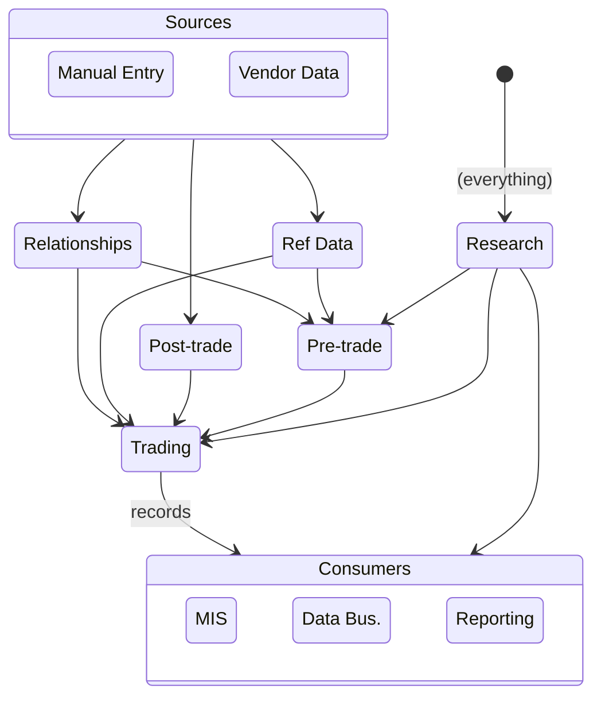

# Background

Data Mesh identified some real unmet needs of the company: 
* Kafka topic naming conventions
* Data classification and access control
* Schema evolution coordination / governance
* Leverage - multiple internal clients should benefit from well-designed, documented API to receive streaming data

But the details of its proposed solutions were misaligned with our needs: 
- Mesh assumed that domains and ownership would match organizational hierarchy, and that it would be straightforward to assign domain and topic ownership. In reality, data domains don't map to org structure. 
- Mesh focused asserted that leveragable publisher apps with owners existed - but they don't. Teams are directly accessing the bondlink database, and  our practical needs are application team(s) that have deep understanding of actual data domains and can own
- Mesh decided on private/protected/public access levels, but this has virtually no utility for us; almost all of our data is "protected", needed by many applications within functional areas (and sometimes across areas), and sensitive in some way that recipients need to respect and be aware of

# Application and Data Domains
* We classify our data based on permitted usage:
    * "display" means free for internal use, including display to users, but not for bulk external redistribution (e.g. because don't have a license to redistribute)
    * "valuable" means it's ours to redistribute, but we charge for it, so still requires careful entitlement and handling
    * "sensitive" means display or redistribution is governed by complex entitlement logic & usage restrictions, could cause significant harm if "leaked" to the wrong party, and special care must be taken when displaying it to our customers
* We define app and data "domains" based on type and sensitivity of the data, clustering sources and consumers of the data in/out
  to help implement reasonable "minimum access" controls without an unmanageable fine-grained ACL matrix.
  (Note: domain does not map to our org structure).
    * Data is generally freely available between applications with a domain (e.g. all trading apps)
    * More-sensitive domains can access less-sensitive domains' data
    * Less-sensitive domains can not access more-sensitive domains' data
* Generally all the apps within a domain publish on topic domains, and domains are free to subscribe to their upstream domains' topics.
  Exception noted with a "topic domain" label below.
    * refdata - instruments, market hours, market conventions, etc. (*display*)
    * relationships - companies, traders, prefs, trading relationships, fees, axe tiers, etc. (*sensitive*)
    * trading - trading activity: orders, responses, trade reports, allocations, etc. (*sensitive*)
        * records - topic domain: curated after the fact trading activity on our platform published from trading:
          trades, orders, etc. (*sensitive*)
    * pretrade - advertisements: axes, inventory, sds req/resp (*sensitive*)
    * research - derived data: cp+, etfnav, etc. but not linked to any order (*valuable*)
    * posttrade - trace and trax (*valuable*)
    * mis - aggregated reporting for internal use (to support finance, management, sales, business owners, etc.; *sensitive*)
    * reporting - reports generated for and distributed to individual clients (e.g. trade recaps) (sensitive)
    * databiz - data products designed for and distributed to external customers (*valuable*)

